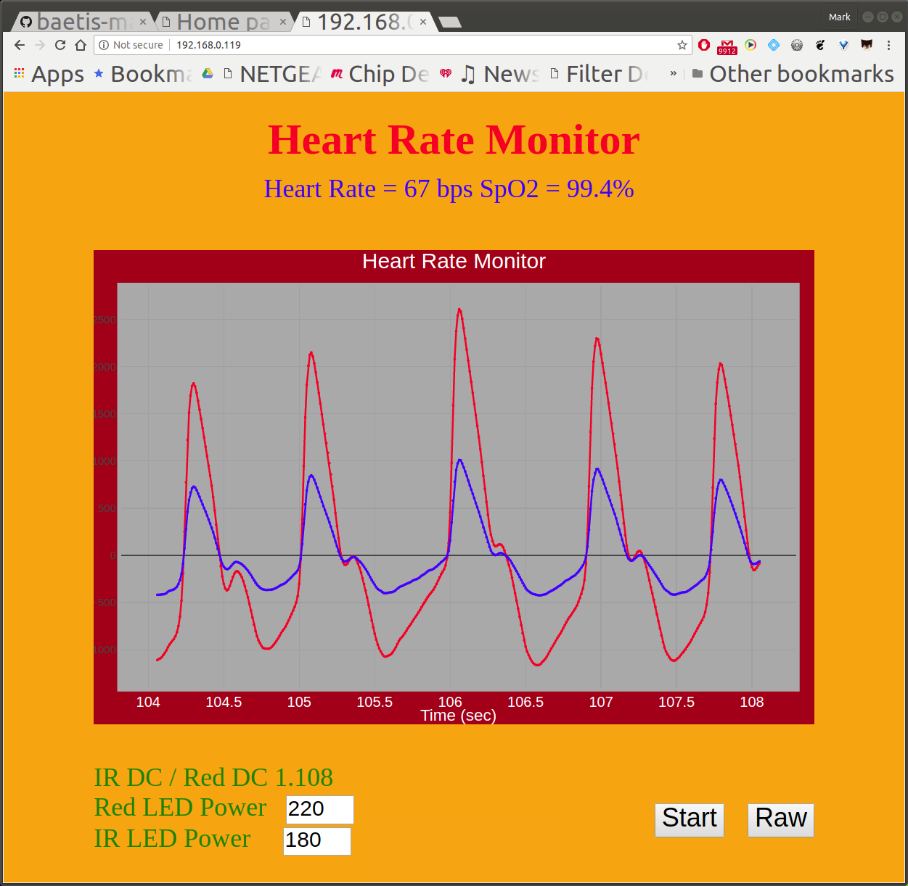

## Heart Rate Monitor and Oximator
</img>
##### This project uses an ESP32S module hooked up to two modules on the i2c bus, a MAX30102 Pulse Oximeter and Heart-Rate Sensor and a SSD1306 OLED display. The oled display shows heart rate and sp02 concentration. The esp host a webpage that can be used to adjust the red and ir led power output, as well as display a graph of the two channels of reflected light returns with and without filtering applied.
##### This project uses Espressif IoT Developemnt Framework (esp-idf) to compile user application code, build the ESP code image and flash it into the ESP device. The setup is pretty easy and well documented on several websites (see esp-idf-webpage project for a walk through).
##### The MAX30102 Pulse Oximeter and Heart-Rate Sensor has a red (660nm) and an infrared (880nm) leds providing pulsed light output at anout 100Hz. A photodetector and 18 bit analog to digital converter read the reflected output light during the peak light ooutput of each of the pulses. When a finger is placed on the chips optical window readings are made of the reflected light at both colors separately. 
##### As the heart beats the capularies near the surface of the skin expand with the pressure increase, the extra blood causes a larger light reflection which shows up as a ~1% ripple on the top of the total reflected light at the heart beat rate. A forth order butterworth bandpass (0.25/25Hz) filter is used to eliminate dc as well as 60Hz noise. It turns out that fully oxegenated blood relects light diffently at 660nm than it does 880nm, the ratio of the percent ripple of the two colors for some reason can be used to calculate the oxygen concentration of the blood.
##### It makes sense for the filtering to be done on the esp module so that the system can calulate pulse rate and spo2 concentration without being attached to a browser running javascript dsp filter calculations. An ESP32S was chosen for this project and the code will not work well with an esp8266.

##### The ESP device establishes a wi-fi connection, then configures the max30102 to collect 100 samples per second of red and IR data. It then initiates two tasks:
##### adc_task() - a loop that
```
adjusts ir and red led power if changed on web page
i2c read the max30102 measurement data buffer pointers
determine if data is present
construct a read of available sample data with I2C bus
configure data into words and load into local buffer
tcp_server_task() - tcp socket listening for http request from wifi
```
##### receive tcp server socket http request
```
parse http request into following three types
file download (ex. index.html, image, .css or a .js file)
if the beginning of the payload contains either "index.html" or "" then the contents of the file index.html are forwarded to browser from esp read only memory space
this program could be easily modified to handle other files
files included in main/components.mk are tranferred to esp rom at build time, start and stop pointer are available to C program
request for a data string dump
the JavaScript in index.html sends an HTTP request header of
GET /getData?irpower=100&xrpower=180&raworbp=0&startstop=0
every 0.5 seconds
The parser updates the esp code global values of irpower, rpower, raworbp and startstop from the webpage
raw data is filtered by a two pole butterworth dsp operation
a comma delimited outstr[] is conctructed with the number of samples available, the average IR value, the average red value followed by alternating red and IR instantaneous values and sent to the JavaScript for display update. The data sent depends on the state of the raworbp flag.
the data pointer for the adc_task() data logging is reset
none of the above sends a 404 page
This nets C source code with no non-esp-idf dependencies of a couple hundred lines, most of which were cut and pasted from the sdk examples folder. The other coding portion of this program is an .html file including a javascript portion (about 200 lines) that is embedded in the esp read only memory at compile time (if referenced in component.mk). The .html file is transfered via tcp to your browser when the esp's url is addressed.
```
##### The JavaScript in the .html has a couple of functions:
```
control of plot modes, ie run/pause, display data type raw/filtered.
send GET query variable data from browser tags to esp (for things like controlling led brightness).
downloads plotly.js for handeling graph real time output display.
formats data returned from esp into plotly format
calculates and displays heartrate and oxygen concentration measurements.
The video starts out with no finger on the max30102 so it just shows noise. When a finger is placed on the module there is a big spike in the graph due to the reflected light going to almost fullscale, the IIR filter takes a little while to filter out the dc, the dc autoranges out, and the heart beats show up pretty clearly. The intensity of red and ir diodes can be changed, the updating can be halted and the unfiltered data can be displayed. The heart rate and SpO2 concentrations are calculated and displayed.
```

##### The tcp_server_task in the esp takes the incoming IP packets combines, windows, verifies/requests retransmission, and notifies us that an http request is ready. When I filled 192.168.0.122/index.html into my browser address bar window the contents of the tcp server (running over in my esp running a wifi connection at IP adrress 192.168.0.122) receive buffer were:

##### The esp programs tcp_sever_task examines the incoming packet and extracts parameters url_type, url_name and url_resource. In the above packet the parameters extracted would be url_type = ‘GET’ and url_name = ‘index.html’ and url_resource is empty, this packet was sent from browser request 192.168.0.122/index.html in the serch bar. The program figures out that this is a request of the contents of the file ‘index.html’ (stored in esp eprom) and forwards it to the tcp server socket send command. The browser executes the data returning from this request will be executed as html.

##### The browser request 192.168.0.122/getData?hello+world tcp_server_task extracts url_name = 'getData' and url_resource = 'hello+world'. The top level subroutine getData() is called - which generated a simple web page output to the socket back to the browser. The url_resource string can be parsed to transfer state from the brower to the esp. The esp can respond in the webpage trnsmitting esp state back to the browser. The browser command above can also be generated by the html code with action commands.
